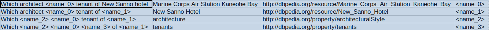

# Method 2: A name tag based method for Q&A

Input: Which architect of Marine Corps Air Station Kaneohe Bay was also tenant of New Sanno hotel ?

- conversion1:` What is the name_0 of the name_1 and name_2 of the name_3 ?`    
- expected output from model: `SELECT DISTINCT ?uri WHERE { name_1 name_0 ?uri. name_3 name_2 ?uri} `    
- converting to usual form: 

```SELECT DISTINCT ?uri WHERE { <http://dbpedia.org/resource/Marine_Corps_Air_Station_Kaneohe_Bay> <http://dbpedia.org/property/architect> ?uri. <http://dbpedia.org/resource/New_Sanno_Hotel> <http://dbpedia.org/ontology/tenant> ?uri} ```
        
---
The work is under progress, the code here is updated for progress tracking purpose.