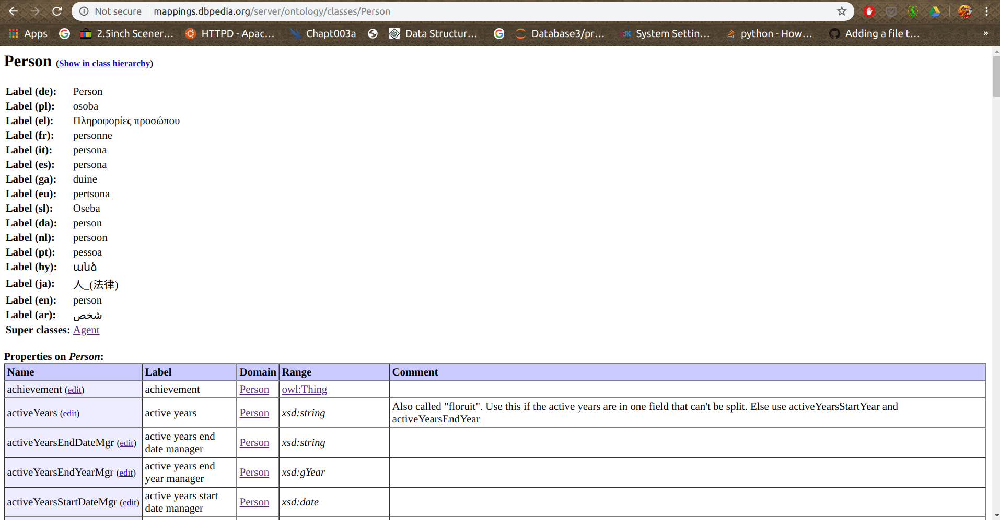

# Pipeline 3 

More functional details will be added later.

To run please use the command:

```bash
python generate_templates.py --label <Ontology name : like Person, the casing matters > --project_name <Give a name to the project like test1 > --depth <Mention the depth to which you would like to penetrate: like 2 >

```

Example

```bash
python generate_templates.py --label Person --project_name test1 --depth 2
```

## Code Notes

The following files are generated by the the following code in the following directory structure:
```
pipeline_3/
       <ProjectName>/
              <<ontologies>.csv>
              <<ontologies>.csv>
              <<ontologies>.csv>
              sentence_and_template_generator
              logfile.log
              test.csv
```

### Use of each file:
- `<<ontologies>.csv>`: The file contain the following information:

|Name   |Label |Domain      |Range|
|----- | -----|----------|-------|
|actingHeadteacher|acting headteacher|EducationalInstitution|Person|
|administrator|administrator|Organisation|Person|
|alumni|alumni|EducationalInstitution|Person|
|assistantPrincipal|assistant principal|EducationalInstitution|owl:Thing|

This information is used to create proper templates.
- `sentence_and_template_generator` this files contains the templates to be used for trian set generation.
- `test.csv` it contains the questions to be used for test set generation.
- `logfile.log`: The code ends to run for a long time, the log file allows you to see what exactly is happening. Like a `Test` prefix is added when a template is added to the test set.

### Note on the `test.csv` and `sentence_and_template_generator` files

- These files contains 7 columns.
- The last colums is for the rank which can be used to remove certain candidate template for them having a lower rank. 

### Other codes:

- `eliminator.py`:  The function remove the templates which are considered as less popular 
based on the proposed ranking mechanism, the input files should be pre processed
and a TRUE or FALSE should be added as the last column. 

- This function just removes the entries with FALSE as the last entry in a row 
and create a file name new_train.csv to be used for futher purposes.


## Generating domain independent templates to minimize burden on the end user for both complex and simple QA

Note ALl links here are with respect to repository: [https://github.com/dbpedia/neural-qa/tree/bd65938173367126f69d4d1bd04d5644be6572ce](https://github.com/dbpedia/neural-qa/tree/bd65938173367126f69d4d1bd04d5644be6572ce)

In my proposal, I had laid down a tentative pseudo code to be followed and this week I implemented a hefty part of it, let's dive into the nitty gritty:

### Generate URL

The first task was to create a URL generator, the main aim was to create something related to the following:

```pseudo
generate_url​ (namespace,class){

       - This function generates a proper url to extract information about class, properties and
       data types from the DBpedia database.
       (Like:​ http://mappings.dbpedia.org/server/ontology/classes/Place​ )

       - It returns a url string to the calling function.
}
```

- To accomplish this, an owl file containing all ontology related details was used, [Owl File](http://mappings.dbpedia.org/server/ontology/dbpedia.owl). Based on the label first corresponding derived from page's URL was extracted by parsing the owl file.

- The page related to this URL contained the URL of the corresponding properties page for the given entity of the form:

```url
http://mappings.dbpedia.org/server/ontology/classes/Person
```

- This URL was then returned to the calling function.

Example:

- Starting command:

```bash
python generate_url.py --label person
```

- Owl file as mentioned above was parsed for corresponding labels and then the corresponding page was obtained of the form:

```url
http://mappings.dbpedia.org/index.php/OntologyClass:Person
```

- The first link on the page corresponding to this URL contained the link to the properties page we were looking for, the whole process was coded to happen automatically. Necessary conditions were put in place to handle exceptions:

```url
http://mappings.dbpedia.org/server/ontology/classes/Person
```

### Get Properties

Once the generate_URL page returned the URL of the properties page of the given entity, the function detached the page and extracted the name, label, range and domain of the property.

```pseudo
get_properties​ (url){
   - This function takes in a url or name of the namespace and class as input like
   get_properties.py code in the current
   codebase(​ https://github.com/AKSW/NSpM/blob/master/gsoc/aman/get_properties.py
   this function takes only a url only).
   -  This code on execution creates a csv which contains all the properties, ontology,
   class related information and data types as field values in each row.
   -  This function also returns a 2D list of the information mentioned above to the calling
   function.
}
```

Example:

```url
http://mappings.dbpedia.org/server/ontology/classes/Person
```

Corresponding page:


Part of extracted properties:

| Name     |     Label      |   Domain   | Range |
|----------|:-------------:|-------:|-------:|
| achievement  |    achievement |Person |owl:Thing  |
| activeYears | active years |  Person |    xsd:string|
| activeYearsEndDateMgr |   active years end date manager | Person |    xsd:string |
  

### Sentence and template generator

Well, this is a tricky and cool one. Let's dive straight into it.

With the help of the 2 functions defined previously we get the following information about the given label:

- *URL of the properties page of the entity with given label*
- *Properties corresponding to the given label with their Name, label, domain and range*

Now it's time to brew some question, SPARQL query and query get entities to fill the templated to be used by the NSPM model. To give you a brief of what each of these terms mean let me give you an example:

- Natural language question template: `When is the  birth date of <A> ?`
- SPARQL query template: `select ?x where { <A>  dbo:birthDate ?x }`
- query get compatible entities: `select distinct(?a) where { ?a dbo:birthDate []  }`, this query can be run to obtain all the entities in DBpedia that have a valid date of Birth. The out on running this queri in [DBpedia SPARQL platform](https://dbpedia.org/sparql)  is as follows:

```list
a
http://dbpedia.org/resource/Andreas_Ekberg
http://dbpedia.org/resource/Danilo_Tognon
http://dbpedia.org/resource/Lorine_Livington_Pruette
http://dbpedia.org/resource/Megan_Lawrence
http://dbpedia.org/resource/Nikolaos_Ventouras
http://dbpedia.org/resource/Sani_ol_molk
http://dbpedia.org/resource/Siniša_Žugić
http://dbpedia.org/resource/William_Bagot,_2nd_Baron_Bagot
http://dbpedia.org/resource/Witold_Gerutto
http://dbpedia.org/resource/Abdoullah_Bamoussa
http://dbpedia.org/resource/Abdul_Waheed_(field_hockey)
http://dbpedia.org/resource/Abdulaziz_Alshatti
http://dbpedia.org/resource/Abdulrahman_Al-Faihan
http://dbpedia.org/resource/Ahmad_Alafasi
http://dbpedia.org/resource/Anatoliy_Abdula
http://dbpedia.org/resource/Antun_Herceg
http://dbpedia.org/resource/Astrit_Hafizi
http://dbpedia.org/resource/Bojan_Pandžić
http://dbpedia.org/resource/Briana_Provancha
http://dbpedia.org/resource/Courtney_Okolo
http://dbpedia.org/resource/Daryl_Homer
http://dbpedia.org/resource/Edward_Ling
http://dbpedia.org/resource/Francesco_Boffo
http://dbpedia.org/resource/Francesco_Brici
http://dbpedia.org/resource/Franciszek_Szymura
```

This list is used by NsPM model to create queries with given template like:

Label | Value |
|:-----|:-----|
Natural language question| `When is the birth date of olga kurylenko ?`|
SPARQL query| `select ?x where { dbr:Olga_Kurylenko dbo:birthDate ?x }`|

With these aspects clear, another point to be noted is the structure of the output file to be compatible with the NsPM model (`;` seperated):

Ontology 1 | Cell 2 | Ontology 2 (verify) | Natural Language query Template | SPARQL query template | Compatible entities fetcher template |
|:----|:----|:----|:----|:----|:----|
dbo:Person ||| When is the  birth date of <A> ? | select ?x where { <A>  dbo:birthDate ?x } | select distinct(?a) where { ?a dbo:birthDate []  } |

---

Generating the queries:

*For natural language question:*

Now for generating viable natural language question, we divide a question into 3 parts:

```python
question_starts_with[number]+prop[1]+ suffix
```

- question_starts_with: defines how the question should start, i.e. what is the or where is the, etc.
- property: is the label of the property under consideration
- suffix: defines how the question should end. (Mainly useful in the recursive question generation, to be discussed shortly)

Example:

- entity: Person, property: dbo:birtDate
- As dbo:birtDate has a range related to a time we set the question starts with to: `When is the`.
- It is the first simple question thus suffix is set to default: `" of <A> ?"`.
- The property is dbo:birtDate with corresponding label `birth date` thus the property is set to:`birth date`.

The natural language question template comes out to be:

```pseudo
When is the  birth date of <A> ?
```

*For SPARQL query:*

Now for generating viable SPARQL query, we divide a query into 3 parts:

```python
(query_starts_with[number]+"where { <A>  "+ query_suffix + prop_link  +" ?x "+ query_ends_with[number])
```

- query_starts_with: defines how the query should start. i.e. select ?x or select count(*) as ?x etc.
- query_suffix: Determines the middle part of the query used mainly in recursive query generation, to be discussed shortly.
- prop_link: contains the URI of the property in the shortened format, like dbo:spouse for `http://dbpedia.org/ontology/spouse`.
- query_ends_with: defines how the query should end. i.e. `} order by ?x limit 1` or `} order by ?x limit 1` etc.

Example:

- entity: Person, property: dbo:birtDate
- query_starts_with: Given the question generated is a `when` question, quert sarts with:`select ?x`.
- query_suffix: It is the first simple question thus suffix is set to default which is a space character.
- prop_link: The propling here will be: `dbo:birthDate` short of `http://dbpedia.org/ontology/birthDate`
- query_ends_with: As the question is a `when` question, the quesry ends with `}`

The SPARQL Query template is of the form:

```sparql
select ?x where { <A>  dbo:birthDate ?x }
```

*Compatible entities fetcher template*

We are about to wander in a bit interesting areas, stride carefully. This template generation depends on a few conditions:

```python
if(query_suffix==""):
       query_answer = ("select distinct(?a) where { ?a "+prop_link+" []  } ")
   else :
       query_answer = ("select distinct(?a) where { ?a "+query_suffix.split(" ")[0]+" [] . ?a  "+query_suffix +" "+ prop_link +" ?x } ")

```

No new variables are used for this part, I will just give an example for the first case here the second one is relevant in recursive questions and query generation.

Example:

- entity: Person, property: dbo:birtDate
- prop_link: The propling here will be: `dbo:birthDate` short of `http://dbpedia.org/ontology/birthDate`

The templates  comes out to be as:

```sparql
select distinct(?a) where { ?a dbo:birthDate []  }
```

---

Recursive question-query generation:

There is one more important variable we have to look into before moving forward, it keeps track of the variable name used in SPARQL queries in each iteration. Count updates accordingly in the later part of the code:

```python
if(count == 0):
       variable = "?x"
   else:
       variable = "?x"+ str(count)
```

To generate recursive query we just update some of the variables before going into the next loop:

```python
query_suffix = prop_link + " "+variable+" . "+variable+" "
suffix = " of "+ prop[1] +" of <A> ?"
```

The ordering is made in this manner to make proper sense, please try running some SPARQL queries to know why the variables are updated as such.

Example:

- Natural language question: `What is the  anthem of birth place of <A> ?`
- SPARQL query: `select ?x where { <A>  dbo:birthPlace ?x1 . ?x1 dbo:anthem ?x  }`
- Compatible entities fetcher: `select distinct(?a) where { ?a dbo:birthPlace [] . ?a  dbo:birthPlace ?x1 . ?x1  dbo:anthem ?x }`

---

All these functions are then properly wrapped in a function called `generate_templates.py`. More work will be done to improve this after the next meeting.
