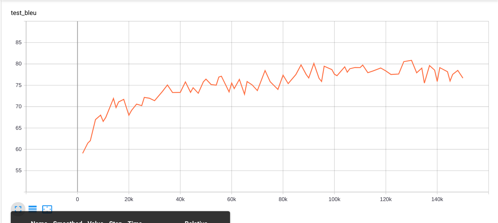
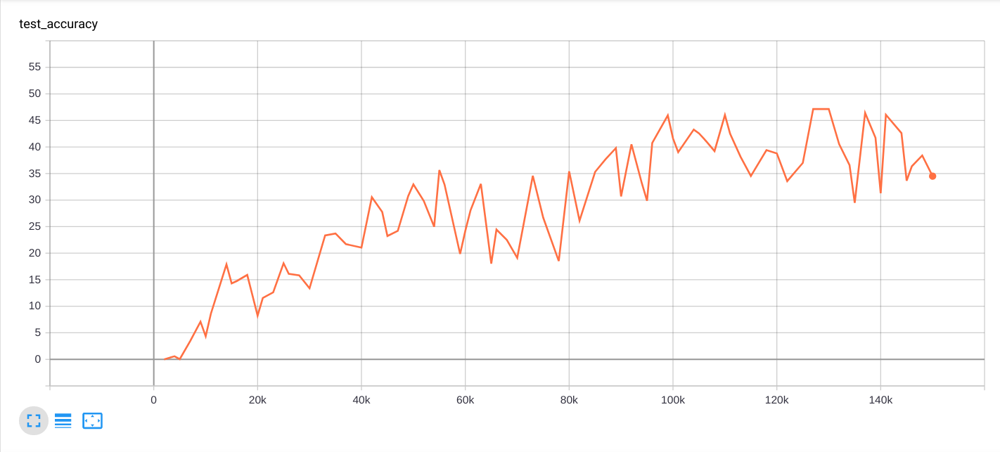

# A Neural QA Model for DBpedia
## Abstract
With booming amount of information being continuously added to the internet, organising the facts becomes a very difficult task. Currently DBpedia hosts billions of such data points and corresponding relations in the RDF format.

Extracting data from such data sources requires a query to be made in SPARQL and the response to the query is a link that contains the information pertaining to the answer or the answer itself.

Accessing such data is difficult for a lay user, who does not know how to write a query. This proposal tries to built upon a System :(​ https://github.com/AKSW/NSpM/tree/master ​) — which tries to make this humongous linked data available to a larger user base in their natural languages(now restricted to English) by improving, adding and amending upon the existing codebase.

The primary objective of the project is to be able to translate any natural language question to a valid SPARQL query.

>> You can find the supporting blogs at : https://anandpanchbhai.com/A-Neural-QA-Model-for-DBpedia/

## Pipeline 1

The code is a completely automated and fixed version of what was done by the previous developer working on the project. The instruction for running the same are provided inside the `pipeline_1` folder.

## Pipeline 3

Pipeline 3 refers to the newest code implementation that was introducedas part of GSoC'19 by Anand Panchbhai. The highlights of this pipeline include the folowing:

- A fast, automated and custom question set generator for DBpedia which can generate questions for any class. 
- It also generates test set to test different composionality based queries.
- The ranking of the questions is also generated as part of the project which help us understand which question might be more natural compared to others. A higher ranl signifies a higher probability of the question being natural.
- This pipeline was used to create test sets on which further experiments were done. an the corresponding results are as follows:

### Eukaryotes

With the following configuration:

| Size  | Layers    | Dropout   | Attention Mechanism   | Embeddings |BLEU | Accuracy |
|------ | ----------| --------  | -------------------   |------------|-----|---------|
|128    |    2      |   0.7     | Scaled Luong          | Yes: SPARQL (RDF2VEC), English Previous embeddings | 93 | 63|

Grid search was done on this dataset to determine the best possible hyperparameters for the NMT model pertaining to the English to SPARQL conversion. THe grid search stats can be found at [Grid Search](https://anandpanchbhai.com/A-Neural-QA-Model-for-DBpedia/static/GridSearch/GridSearch.html)

### Person

After successfully  completing the Grid search on the Eukaryotes data we moved on to checking the viability of the model on other ontologies namely Person. The data set was humongous compared to what we had dealt with earlier. The train set contained: 302277 queries and the test after thresholding contained: 113982 queries. We were still able to get some pretty interesting results for our best expected model configuration obtained from the grid search done earlier:

With the following configuration:

| Size  | Layers    | Dropout   | Attention Mechanism   | Embeddings |BLEU | Accuracy |
|------ | ----------| --------  | -------------------   |------------|-----|---------|
|128    |    2      |   0.7     | Scaled Luong          | Yes: SPARQL (RDF2VEC), English Previous embeddings | 80 | 40|

The graphs are as follows:

BLEU scores for person test set.

Accuracy scores for person test set.

## Utilities

Apart from the main project a number of utilities were created various tasks from full fledge code to few lines of script. A brief of those utilities is as follows. I encourage you to feel free to use them for evaluating, pre-processing and analyse different aspects of the project. The utilities are present in `pepeline_3/utility`

- Comparer
- Relavent embedding extractor
- QALD JSON geberator to enable use in GERBIL
- Test fixer for thresholding the question present in the general test set.
- Vocab extractor from previous tensorflow models.

Specific instructions for running each of the utilities is provided in their respective directories.

