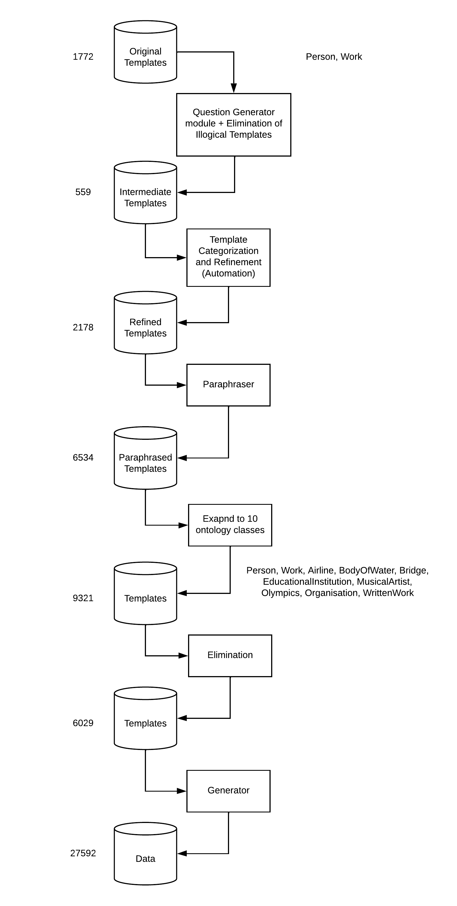

# Template Discovery for Neural Question Answering over DBpedia

GSoC: https://summerofcode.withgoogle.com/programs/2022/projects/oDLorC8K  
Project: https://github.com/dbpedia/neural-qa  
Blog: https://sauravjoshi23.github.io/GSoC-Neural-QA-Model-DBpedia/  
Proposal: https://drive.google.com/file/d/1-HOKbBHJArXl9MPDbMxv8FcJpQ-IojmS/edit  

## Question Generator

To automate the process of creating basic templates, the Question Generator module is utilized. Initially, the templates were formed using rules, and hence the syntactic structure of most of the templates was very similar. Using the QGen module, the templates are a bit more natural and varied syntactically while keeping the semantics the same. Although, this technique is already an open-source work trained on relatively less data, it doesn't help us achieve our goal and due to that we perform further tasks to make the templates more natural.

## Classes Generation

The final templates generated after QGen module are categorized into 5 classes - subordinate, con/disjunction, comparative(+boolean), superlative, and numeric using basic automated modules and functionalities. Upon initial categorization, classes may have templates that overlap but later these templates are transformed to make them class-specific. For example, a template - What is the child of \<A> ? will be transformed to How many child did \<A> have ? in numeric class and to Did \<A> have child ? in comparative class. 

## Paraphraser

After a series of steps in the process of template discovery, the next step is to make the templates more natural using a paraphraser. The T5 paraphraser is used and the technique using which the templates are paraphrased is found in [Zheyuan’s blog](https://baiblanc.github.io/2020/08/27/GSOC-Final-Report/). 

## Elimination

Each ontology class contains templates that are really very efficient but some don’t make much sense. As the number of such templates is significant, they need to be eliminated. The refined and paraphrased templates were paired together i.e (pair1 - refined + paraphrase1, pair2 - refined + paraphrase2). The first step is the initial elimination step where embeddings are extracted of all the texts, then cosine similarity between all the pairs is calculated. A threshold is set and only those pairs are kept that have similarity value higher than the threshold. After initial elimination of illogical paraphrased templates, the goal is to predict which template to select i.e refined or paraphrased because there might be certain paraphrased templates in the dataset (after elimination) that are not quite efficient. The 2 methods used are - Commonsense understanding, and Quora Question pairs task.

## Template Discovery Pipeline

